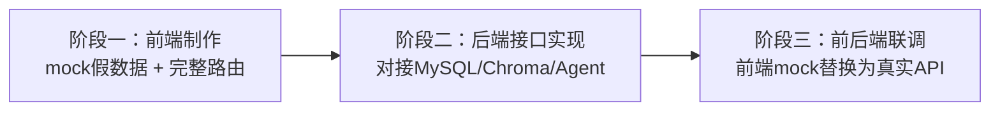

# 宸甄 PrivRAG 前后端业务服务开发执行文档

> 版本：v1.1 ｜ 更新日期：2026-08-13（后端方案细化版：含技术决策、表设计、实施步骤）
> 配套文档：[接口JSON契约文档.md](./接口JSON契约文档.md)（前端 mock 数据与后端接口的对接依据，务必保持两侧字段一致）

---

## 一、项目现状盘点

| 模块 | 现状 | 说明 |
|---|---|---|
| 后端框架 | FastAPI 主入口已建立 | `backend/app/main.py` 已创建，仅注册了 `documents` 路由（占位） |
| Agent 主体 | ✅ 已完成 | `backend/app/service/agent/react_agent.py`，`ReActAgent.execute_stream()` 支持流式输出，**直接引用，不改动** |
| RAG 检索 | ✅ 已完成 | `backend/app/service/rag/rag_service.py`（RagSummarizeService）、`vector_store.py`（VectorStoreService，基于 Chroma），**直接引用，不改动** |
| 对话历史 | ✅ 已完成 | `backend/app/service/history/history_store.py`，按 session_id 以 JSON 文件持久化，**直接引用，不改动** |
| 模型工厂 | ✅ 已完成 | `backend/app/modelFactory/factory.py`，提供 `chat_model` / `embed_model`，**直接引用，不改动** |
| 数据模型 | ✅ 已定义三张表 | `models/users.py`（User）、`models/documents.py`（Document）、`models/document_chunk.py`（DocumentChunk），基于 SQLModel，MySQL 尚未接入 |
| 路由层 | ⚠️ 占位 | `backend/app/routers/documents.py` 仅一个空接口（且缺少前导 `/`），需重写 |
| 数据库接入 | ❌ 未做 | MySQL 连接、建表、初始化均未实现 |
| 前端 | ❌ 仅骨架 | `frontend/` 只有空 App.vue + main.js，无路由、无 UI 库、无页面 |
| Logo 资源 | ✅ 已就位 | `frontend/src/assets/images/` 下已有横版完整 Logo 与纯图形 Logo，前端直接引入，禁止 AI 绘制 |

### 1.1 现有数据库表结构（后端阶段对接依据）

**user 表**：`id`、`username`（登录账号）、`password_hash`、`full_name`、`created_at`、`last_login`

**document 表**：`id`、`md5_hash`、`title`、`file_name`、`file_type`、`file_size`、`uploader_id`（外键）

**document_chunk 表**：`id`、`chunk_index`、`content`、`vector_id`、`document_id`（外键）

> ⚠️ 前端需求与现有模型存在差异（手机号登录、入库时间、向量化状态等），需在后端阶段扩展模型字段，详见「四、后端制作执行方案」。

---

## 二、总体开发规划

按依赖关系分三个阶段推进，前端先行（mock 数据可独立运行），后端随后（对接接口契约），最后联调：



| 阶段 | 内容 | 依赖 | 状态 |
|---|---|---|---|
| 阶段一 | 前端 Vue3 全部页面（登录、主框架、Bot问答、知识库、统计、设置），mock 数据，可独立运行 | 接口契约文档 | ✅ 已完成（2026-08-13，浏览器逐项验收通过） |
| 阶段二 | 后端全部接口（认证、会话、文档、统计、配置），建表、接 Agent/RAG | 接口契约文档 | 方案已细化（见第四章），待用户确认后执行 |
| 阶段三 | 前后端联调，前端通过 axios 调用真实接口，替换 mock | 阶段一、二 | 后续执行 |

---

## 三、前端制作执行方案（本次执行）

### 3.1 技术选型

| 依赖 | 用途 | 说明 |
|---|---|---|
| Vue 3（组合式 API + `<script setup>`） | 框架 | 已存在，沿用 |
| Vite | 构建 | 已存在，沿用 |
| element-plus | UI 组件库 | 需安装 |
| @element-plus/icons-vue | 图标 | 需安装 |
| vue-router@4 | 路由 | 需安装，配置完整路由 |
| echarts | 图表 | 需安装，统计数据页使用 |
| axios | HTTP 客户端 | 需安装，预留对接后端；mock 阶段封装在 `src/api/` 内做假数据返回 |

安装命令（在 `frontend/` 目录下执行）：

```bash
npm install element-plus @element-plus/icons-vue vue-router@4 echarts axios
```

### 3.2 设计规范（UI 强制约束，参考 `前端制作参考资料/前端制作提示词.md`）

蓝色科技简约企业风格，禁止高饱和刺眼亮色、禁止花哨动画、留白充足。

统一使用 CSS 变量，在 `src/assets/styles/` 下定义全局变量：

```css
:root {
  /* 品牌色 */
  --brand-color: #165DFF;          /* 主按钮、顶栏、侧边栏 */
  --brand-color-hover: #4080FF;    /* 主按钮 hover（低饱和蓝系） */
  --brand-color-disabled: #94BFFF;
  --brand-color-light: #E8F3FF;    /* 用户气泡/浅蓝辅助 */
  --brand-color-light-hover: #D6E8FF;

  /* 中性色 */
  --text-main: #1D2129;            /* 主要文本 */
  --text-secondary: #86909C;       /* 辅助说明文本 */
  --text-disabled: #C9CDD4;

  /* 背景与边框 */
  --bg-page: #FFFFFF;              /* 页面主体内容区域纯白 */
  --bg-card: #F7F9FC;              /* 卡片浅灰白 */
  --border-light: #E5E6EB;

  /* 功能色 */
  --danger: #F53F3F;               /* 删除/危险操作 */
  --success: #00B42A;              /* 成功标签 */
  --shadow-card: 0 2px 8px rgba(0, 0, 0, 0.06);  /* 柔和阴影 */
  --shadow-dialog: 0 8px 24px rgba(0, 0, 0, 0.12);
}
```

字体：正文使用系统中文字体栈（`-apple-system, "Segoe UI", "PingFang SC", "Microsoft YaHei", sans-serif`），大数字（统计卡片）加粗加大，不引入花哨英文字体。

### 3.3 前端目录结构（在现有 frontend 骨架基础上扩展）

```plaintext
frontend/
├── index.html
├── vite.config.js                 # 已配置 /api 代理到 localhost:8000，保留
├── package.json
└── src/
    ├── main.js                    # 改造：注册 ElementPlus、router、图标、全局样式
    ├── App.vue                    # 改造：仅放 <router-view>
    ├── assets/
    │   ├── images/                # 已有两份 Logo 资源，直接引用
    │   └── styles/
    │       ├── variables.css      # 3.2 设计规范变量
    │       └── global.css         # 全局重置、公共类（页面容器、卡片）
    ├── router/
    │   └── index.js               # 完整路由 + 登录守卫
    ├── utils/
    │   ├── auth.js                # mock 登录态存取（localStorage）
    │   └── format.js              # 文件大小/日期格式化
    ├── api/                       # 接口层：先返回 mock，后续替换 axios 真实请求
    │   ├── request.js             # axios 实例（预留：baseURL=/api、响应拦截）
    │   ├── auth.js
    │   ├── chat.js
    │   ├── documents.js
    │   ├── statistics.js
    │   └── settings.js
    ├── mock/                      # mock 数据源（字段严格对齐接口契约文档）
    │   ├── auth.js
    │   ├── chat.js
    │   ├── documents.js
    │   ├── statistics.js
    │   └── settings.js
    ├── layout/
    │   └── AppLayout.vue          # 全局主框架：顶部导航 + 左侧菜单 + 右侧内容
    └── views/
        ├── LoginRegister.vue      # 页面1：登录注册
        ├── chat/
        │   └── ChatView.vue       # 子页面A：Bot问答
        ├── knowledge/
        │   └── KnowledgeView.vue  # 子页面B：知识库
        ├── statistics/
        │   └── StatisticsView.vue # 子页面C：统计数据
        └── settings/
            └── SettingsView.vue   # 子页面D：系统设置
```

### 3.4 路由表

| 路径 | 组件 | 说明 | 守卫 |
|---|---|---|---|
| `/login` | LoginRegister.vue | 登录注册页 | 已登录访问则跳转 `/chat` |
| `/` | AppLayout.vue | 主框架，`redirect: /chat` | 未登录跳转 `/login` |
| `/chat` | ChatView.vue | Bot 问答 | 需登录 |
| `/knowledge` | KnowledgeView.vue | 知识库 | 需登录 |
| `/statistics` | StatisticsView.vue | 统计数据 | 需登录 |
| `/settings` | SettingsView.vue | 系统设置 | 需登录 |

路由守卫逻辑：`beforeEach` 中读取 mock 登录态（localStorage 的 `privrag_token`），访问 `/` 及子路由未登录 → 重定向 `/login`；已登录访问 `/login` → 重定向 `/chat`。

### 3.5 页面与组件拆分

**页面1：登录注册页 `LoginRegister.vue`**
- 左右对半分栏（复用参考图1布局结构，不采用其配色）：
  - 左栏：`#F7F9FC` 浅灰白背景，垂直居中放置横版完整 Logo，下方 slogan「企业私有RAG知识库 · 文档本地安全可控」
  - 右栏：白色居中圆角卡片，`el-tabs` 切换「登录 / 注册」
- 登录：手机号（必填校验）、密码（必填校验 + 末尾眼睛图标显隐）、记住我、蓝色主按钮；mock 成功后写入登录态并跳转 `/chat`
- 注册：手机号、短信验证码、密码、确认密码；两次密码不一致给出校验提示
- 底部版权小字：`宸甄 PrivRAG ©2026 企业私有文档平台`
- 校验规则使用 `el-form` 的 `rules`，mock 验证码固定为 `123456`

**页面2：全局主框架 `AppLayout.vue`**
- 顶部导航栏：`#165DFF` 背景；左上角横版 Logo；右上角圆形用户头像占位，`el-dropdown` 下拉：个人信息（跳 `/settings`）、修改密码（跳 `/settings`）、退出登录（清登录态 → `/login`）
- 左侧菜单：`#165DFF` 背景、白色文字，4 个菜单项：Bot问答 `/chat`、知识库 `/knowledge`、统计数据 `/statistics`、系统设置 `/settings`，`el-menu` 的 `router` 模式，当前项高亮
- 右侧内容容器：`#FFFFFF` 背景，`<router-view>` 渲染子页面

**子页面A：Bot问答 `ChatView.vue`**（左右两栏）
- 左窄栏（约 280px）：
  - 顶部【新建会话】蓝色按钮 → 新增一条 mock 会话并自动切换
  - 会话列表：每条显示标题，hover 出现删除图标 → `ElMessageBox.confirm` 二次确认删除
  - mock 生成 3-5 条历史会话（字段对齐契约文档）
- 右宽栏：
  - 消息列表占满剩余高度，可滚动；用户气泡靠右（`--brand-color-light` 底），AI 气泡靠左（白色底）
  - 每条 AI 消息底部固定【引用知识库来源】`el-collapse` 折叠模块，默认折叠，展开显示引用文档列表（文档名称 + 片段摘要）——**系统重要功能，不允许省略**
  - 底部固定输入区：`el-input type="textarea"` 多行输入 + 【发送】主蓝按钮 + 【清空当前会话】灰色次要按钮
- mock 交互：发送后立即追加用户气泡 → 模拟 1.2-2s 延迟 → 追加 AI 气泡 + 引用来源

**子页面B：知识库 `KnowledgeView.vue`**（强制表格，禁止卡片）
- 顶部工具栏横向排布：左侧【上传文档】蓝色按钮；中间文档名称搜索输入框；右侧排序下拉（入库时间默认 / 文档名称 / 文档大小 / 文档类型）
- 上传弹窗 `el-dialog`：说明支持格式 `pdf、docx、doc、txt、md、xlsx`；限制「单个文件最大 100MB、批量总大小 ≤ 125MB」；`el-upload` 多选本地文件（`auto-upload=false`）；确认上传 mock 成功 → 关闭弹窗 + 表格新增一行 + `ElMessage.success` 提示
- `el-table` 平铺，列固定顺序：1.文档名称 2.文档类型 3.文档大小 4.入库时间 5.向量化状态（成功绿色标签/失败红色标签）6.操作列（查看预览/下载/删除，小型按钮）
  - 查看预览：`el-dialog` 模拟预览（仅 UI）
  - 下载：mock 按钮
  - 删除：`ElMessageBox.confirm` 二次确认后移除行
- 底部 `el-pagination` 分页（mock 分页）
- 空状态：`el-table` 无数据时显示「暂无文档，请上传企业文档构建私有知识库」

**子页面C：统计数据 `StatisticsView.vue`**（ECharts，蓝色系统一配色）
- 顶部 4 个等宽统计卡片（`--bg-card` + 柔和阴影）：文档总数量 / 全部文档总占用大小 / 向量化成功文档数 / 向量化失败文档数，大字号数值 + 小字指标名
- 图表两行布局：第一行左右两图（左上饼图：各类文件类型占比；右上柱状图：近30天每日入库趋势）；第二行居中环形图（向量化成功与失败占比）
- 全部图表配色使用项目蓝色系（#165DFF 系渐变），拒绝五颜六色
- 空状态：文档总数为 0 时图表区域整体显示「暂无文档统计数据，请前往知识库上传文档」
- 图表按窗口 resize 自适应，组件卸载时销毁实例

**子页面D：系统设置 `SettingsView.vue`**
- 上下两块独立表单卡片（`--bg-card` + 柔和阴影，卡片间留间距）
- 卡片一：个人信息 —— 头像上传占位（`el-upload` 圆形容器）、昵称输入框；下方分组修改密码：旧密码/新密码/确认新密码；右下角【保存修改】蓝色按钮 → mock 保存成功 `ElMessage.success`
- 卡片二：RAG 参数 —— 切分块大小数字输入框、检索 Top-K 数字输入框（预留后续参数扩展位置）；右下角【保存参数】蓝色按钮 → mock 保存成功提示

### 3.6 Mock 数据方案

- mock 数据集中在 `src/mock/`，字段、类型、嵌套结构**严格对齐** [接口JSON契约文档.md](./接口JSON契约文档.md)，保证后续替换真实 API 时零改动页面代码
- `src/api/` 中各模块导出异步函数，当前实现直接 `return mock 数据`（可加 200-500ms 延迟模拟网络）；后端就绪后仅替换 `request.js` 为 axios 真实调用，函数签名不变
- 登录态：`localStorage` 存 `privrag_token` 与 `privrag_user`（mock）
- 会话数据、文档数据均为前端写死的 mock 数组，增删改只在内存中操作，不刷新持久化

### 3.7 前端实施步骤（顺序）

1. 安装依赖：`element-plus`、`@element-plus/icons-vue`、`vue-router@4`、`echarts`、`axios`
2. 初始化工程骨架：改造 `main.js`（注册 ElementPlus + Router + 图标 + 全局样式）、`App.vue`（router-view）、新增全局样式变量
3. 编写 `src/utils/auth.js`（mock 登录态）与 `src/utils/format.js`
4. 编写 `src/mock/` 五个数据源（对齐契约文档）
5. 编写 `src/api/` 五个接口模块（先返回 mock）
6. 配置 `src/router/index.js` 完整路由 + 守卫
7. 实现登录注册页 `LoginRegister.vue`
8. 实现主框架 `layout/AppLayout.vue`
9. 实现 Bot 问答页 `views/chat/ChatView.vue`
10. 实现知识库页 `views/knowledge/KnowledgeView.vue`
11. 实现统计数据页 `views/statistics/StatisticsView.vue`
12. 实现系统设置页 `views/settings/SettingsView.vue`
13. 自测：`npm run dev` 逐页走查（路由切换、守卫、表单校验、删除二次确认、消息提示、空状态、图表渲染）
14. 验收通过后结束本次前端执行

### 3.8 验收标准（对照提示词逐条）

- [ ] 登录页左右对半分栏、右栏卡片内登录/注册 Tab 切换、表单校验完整、mock 登录后跳转主框架
- [ ] 路由守卫生效：未登录访问主页路由重定向登录页
- [ ] 主框架：深蓝顶栏 + 深蓝侧边菜单 4 项可切换、内容区白色、当前菜单高亮
- [ ] Bot 问答：会话新建/删除（二次确认）/切换；气泡左右分色；AI 回复底部必带【引用知识库来源】折叠模块；发送延迟 1.2-2s 追加 AI 回复；清空会话
- [ ] 知识库：强制表格、列顺序正确、上传弹窗（格式/大小限制文案）、搜索、排序、预览/下载/删除（二次确认）、分页、空状态文案
- [ ] 统计数据：4 个统计卡片 + 3 个 ECharts 图表 + 空状态；蓝色系配色
- [ ] 系统设置：两张表单卡片、保存 mock 提示
- [ ] 所有删除类操作均有二次确认；所有保存/上传均有消息提示
- [ ] `npm run dev` 可运行、路由完整、无真实 http 请求

---

## 四、后端制作执行方案（记录，待执行）

> 原则：**不改动** `service/agent/`、`service/rag/rag_service.py`、`service/history/`、`modelFactory/` 等已完成功能代码，只读引用；允许修改 `service/rag/vector_store.py`（Chroma→Qdrant 迁移，已授权）与路由层（现有路由为占位，直接重写）。后端基于 **FastAPI** 构建。
> **日志规范**：系统已有日志器服务 `app/utils/logger_handler.py`（`logger = get_logger()`），所有新增代码（路由、服务、数据库、后台任务）在必要位置统一引入并记录关键执行日志——认证（登录/注册/验证码）、文档（上传/删除/向量化）、问答、数据库初始化、异常捕获等，沿用现有格式（`logger.info` / `logger.error` 等）。

### 4.1 现状与待处理问题（动手前必须先解决）

| # | 问题 | 位置 | 处理方式 |
|---|---|---|---|
| 1 | 路由缺前导斜杠，接口无法访问 | `routers/documents.py` L8 | 现有路由为占位，直接重写为完整文档接口（`@router.get("/categories")` 等） |
| 2 | 外键引用写法错误 | `models/document_chunk.py` L14 `foreign_key="document_id"` | 改为 `foreign_key="document.id"`（SQLModel 约定） |
| 3 | models 之间为相对导入 | `models/*.py` | 改为包内规范导入 `from app.models.users import User` 等 |
| 4 | User 无手机号/头像字段，前端登录用手机号 | `models/users.py` | 新增 `phone`（unique）+ `avatar` 字段；`username` 保留但注册时可省略 |
| 5 | Document 无入库时间、向量化状态、存储路径字段 | `models/documents.py` | 新增 `created_at`、`vectorize_status`（processing/success/failed）、`vectorize_message`、`file_path` |
| 6 | `load_db_config()` 引用的 db_config.yml 已被删除（有意），`config_handler` 导入即报错 | `utils/config_handler.py` L25-28、L40 | 删除 `load_db_config()` 与 `db_conf`；数据库配置改由**环境变量**提供（见 4.2 决策2） |
| 7 | Chroma 向量库需迁移为 Qdrant | `service/rag/vector_store.py`、`config/chroma_config.yml` | 重写为 Qdrant 版（见 4.2 决策3），删除 `backend/chroma_db/` 与 `chromadb`/`langchain-chroma` 依赖 |
| 8 | 会话列表/消息需独立表，原文件历史无法存 citations | 无 | 新增 `chat_conversation`、`chat_message` 两张表（见 4.3） |
| 9 | Agent/RAG 会话历史 session_id 硬编码 `user_001`，**不支持多会话隔离** | `config/rag_config.yml` | **记录为已知限制，本期不修复**（见 4.5） |
| 10 | md5 去重仍走 md5.txt 文件，需迁移到 document 表 | `utils/file_handler.py`（`check_md5_hex`/`save_md5_hex`，且顶部 `from ... import chroma_conf`）、`service/rag/vector_store.py` `load_document()`、config 的 `md5_hex_store` 字段 | 去重统一改查 document 表 `md5_hash`(unique)；移除 md5.txt 机制；`file_handler.py` 同步移除相关函数与 `chroma_conf` 引用（见 4.4 步骤 3/6） |

### 4.2 技术决策（已与用户确认）

| # | 决策点 | 结论 | 说明 |
|---|---|---|---|
| 1 | 基础设施 | docker compose 启动 `mysql:8.4` + `qdrant:v1.16`（模式A） | `docker/env/.env.dev` 已存在（MySQL：privrag_dev / privrag / privrag_dev_123456；Qdrant collection：privrag_dev），直接使用 |
| 2 | 数据库配置方式 | 不建 `db_config.yml`，**环境变量**提供 | 新增 `app/database/db.py`，从环境变量读取（MYSQL_HOST/PORT/USER/PASSWORD/DATABASE），本地开发默认 `127.0.0.1:3306`；docker compose 内注入 `MYSQL_HOST=mysql` 覆盖 |
| 3 | 向量库 | Chroma → **Qdrant** | 使用 `langchain_qdrant` + `qdrant-client`；`VectorStoreService` 对外接口（`get_retriever`/`load_document`）保持不变，RAG 服务零改动；直接删除 `chroma_db/` |
| 4 | 认证方案 | `passlib[bcrypt]` + `pyjwt` | ⚠️ 注意：Python 3.13 + passlib 需配套 `bcrypt==4.0.1`（passlib 与 bcrypt≥4.1 不兼容）；若安装受阻则改用直接调用 `bcrypt` 库 |
| 5 | 消息持久化 | 新增 `chat_message` 表（含 citations JSON 字段） | 与前端契约完全对齐；Agent 多轮记忆仍走原 `ChatMessageHistory` 文件（session_id=conversation_id） |
| 6 | RAG 参数保存 | 写入 `qdrant_config.yml` | `chunk_size` / `k`（Top-K）保存后需**重启服务生效**，设置页返回提示文案；不新增参数表，避免改动既有读取链路 |
| 7 | 上传向量化 | 异步后台任务 | 上传接口先落库返回（`vectorize_status=processing`），`BackgroundTasks` 异步执行切分+入库+更新状态，前端轮询刷新可见 |
| 8 | 会话多开 | 本期共享会话历史 | 会话列表/消息 CRUD 正常；历史记忆隔离列入后续修复（见 4.5） |

### 4.3 数据表设计（SQLModel，共 5 张）

| 表 | 字段 | 说明 |
|---|---|---|
| user | id、phone(unique)、username(可空)、password_hash、full_name(nickname)、avatar、created_at、last_login | 登录用 phone+password，密码 bcrypt 哈希存储 |
| document | id、md5_hash(unique)、file_name、file_type、file_size、file_path、created_at、vectorize_status、vectorize_message、uploader_id(FK) | 契约字段映射：name=file_name、type=file_type、size=file_size、uploadedAt=created_at、vectorizeStatus=vectorize_status |
| document_chunk | id、chunk_index、content、vector_id、document_id(FK) | `vector_id` 存 Qdrant point id，删除时据此删向量 |
| chat_conversation | id、user_id(FK)、title、created_at、updated_at | 会话列表，接口按 updatedAt 降序返回 |
| chat_message | id、conversation_id(FK)、role、content、citations(JSON)、created_at | citations 存 `[{documentId, documentName, snippet}]` |

- 数据库：`privrag_dev`（utf8mb4）
- 建表：应用启动 lifespan 中执行 `init_db()`（`SQLModel.metadata.create_all`，新增表自动创建，不破坏已有表）

### 4.4 后端实施步骤（顺序执行）

**阶段 0：基础设施与环境**
1. 启动基础设施：`docker compose --env-file docker/env/.env.dev up -d mysql qdrant`，`docker compose ps` 验证均 Up(healthy)
2. 依赖调整（`backend/` 下）：
   - 新增：`passlib[bcrypt]`（或 `bcrypt`）、`pyjwt`、`langchain-qdrant`、`qdrant-client`
   - 移除：`chromadb`、`langchain-chroma`

**阶段 1：配置与基础模块**
3. 配置改造：
   - 新建 `config/qdrant_config.yml`（host、port、collection_name、chunk_size、chunk_overlap、separators、data_path、allow_knowledge_file_type、k；**不再含 `md5_hex_store`，文件去重改由 document 表 `md5_hash` 承担**），删除 `config/chroma_config.yml`
   - `utils/config_handler.py`：删除 `load_chroma_config`/`chroma_conf` 与 `load_db_config`/`db_conf`；新增 `load_qdrant_config`/`qdrant_conf`
4. 新增 `app/database/`：`db.py`（环境变量读取连接串 → `create_async_engine`(aiomysql) → `async_sessionmaker` → `get_session` 依赖 + `init_db()`）
5. 模型修复与扩展（4.1 的 #2-#5）+ 新增 `models/chat_conversation.py`、`models/chat_message.py`（citations 用 JSON 列）

**阶段 2：向量库迁移与认证**
6. 重写 `service/rag/vector_store.py`：`langchain_qdrant.Qdrant` 接入（host/port/collection，复用 `embed_model` 与现有文本分割器）；保留 `get_retriever()` / `load_document()` 原签名；新增：
   - `upload_file(file_path)`：单文件切分 → 入 Qdrant → 返回 `[(chunk_text, vector_id)]`（供写 document_chunk）
   - `delete_by_vector_ids(vector_ids)`：按 vector_id 批量删除 Qdrant 向量
   - **md5 去重迁移**：`load_document()` 原基于 `check_md5_hex`/`save_md5_hex`（md5.txt）的去重逻辑改为查询/写入 document 表 `md5_hash`；同步清理 `utils/file_handler.py` 中的 `check_md5_hex`/`save_md5_hex` 及顶部 `chroma_conf` 引用（该文件若不再被使用则一并评估移除）
7. 认证模块：
   - `app/core/security.py`：bcrypt 密码哈希/校验、JWT 签发/校验（pyjwt）
   - `routers/auth.py`：`POST /login`、`POST /register`、`POST /sms-code`（开发期固定 123456，写日志）、`POST /logout`、`GET /me`、`PUT /profile`、`PUT /password`
   - `app/dependencies.py`：`get_current_user`（解析 Bearer token）

**阶段 3：业务接口**
8. 文档模块（重写 `routers/documents.py`）：
   - `POST /upload`：multipart 多文件 → 校验格式/大小（契约限制）→ md5 查 Document 表去重 → 落盘 `backend/app/data/` → 写 Document 行（processing）→ `BackgroundTasks` 调 `VectorStoreService.upload_file` 向量化 → 写 document_chunk + 更新 status
   - `GET /documents`：分页 + keyword 模糊搜索 + sortBy/sortOrder 排序
   - `GET /{id}/preview`：读文件文本返回；`GET /{id}/download`：`FileResponse`
   - `DELETE /{id}`：查 chunk vector_id 列表 → `delete_by_vector_ids` 删 Qdrant → 删 DB 行（级联 chunk）→ 删物理文件，三方同步
9. 会话模块（新增 `routers/chat.py`）：
   - 会话 CRUD（对齐契约）；`GET /{id}/messages` 读 chat_message 表
   - `POST /messages`：入库 user 消息 → **引用** `RagSummarizeService.rag_summarize(query)` 生成回答（历史按 4.5 限制共享）→ 单独调用 `VectorStoreService().get_retriever()` 检索命中文档，反查 Document 表拼装 citations → 入库 assistant 消息返回
   - `DELETE /conversations/{id}/messages`：清空会话消息
10. 统计模块（新增 `routers/statistics.py`）：SQL 聚合查询 document 表
    - `GET /overview`：count(*) / sum(file_size) / 向量化成功数 / 失败数
    - `GET /file-type-distribution`：group by file_type
    - `GET /daily-trend?days=30`：group by date(created_at)
    - `GET /vectorization-status`：success/failed 计数
11. 设置模块（新增 `routers/settings.py`）：`GET/PUT /api/settings/rag-config` 读写 `qdrant_config.yml` 的 `chunk_size` 与 `k`，返回「重启后生效」提示

**阶段 4：收尾**
12. `main.py`：lifespan 执行 `init_db()`；注册 auth/chat/documents/statistics/settings 全部路由
13. 自测：`backend/` 下 `uv run fastapi dev`，按契约文档逐接口验证（登录→建会话→提问→引用来源→上传→统计→设置），并验证前端 `/api` 代理连通
14. 前端联调前置：替换 `src/api/` 为 axios 真实请求后逐页验证

### 4.5 已知限制与后续修复（记录，本期不执行）

> ✅ 2026-08-13 已修复：**多会话历史隔离**——`rag_summarize(query, session_id=None)` 支持按会话传入隔离标识（chat API 以 `user_{uid}_conv_{cid}` 作为 session_id），历史文件按会话独立存储于 `backend/chat_history/`；`session_id` 缺省时回退 `rag_conf` 配置，原有调用不受影响。

| 限制 | 现状 | 后续修复方案 |
|---|---|---|
| ~~多会话历史隔离~~（已修复） | ~~`rag_summarize()` 从 `rag_conf["session_config"]` 读 session_id（硬编码 `user_001`），所有会话共享同一份 Agent 对话历史~~ | 已实现：chat API 传入 `user_{uid}_conv_{cid}` 作为 session_id，各会话历史独立 |
| citations 与回答各自检索 | chat 接口为拼装 citations 单独调用一次 retriever，与 RAG 链内部检索重复执行 | 后续将检索结果透出链（需改 rag_service），一次检索两处使用 |
| RAG 参数实时生效 | 参数写入 YAML，重启后生效 | 如需热生效，再评估 system_config 表方案 |

### 4.6 与前端对接约定

- 统一响应包裹 `{code, message, data}`（code=0 成功），HTTP 状态与业务 code 定义见契约文档
- 前端 `/api` 已代理到 `http://localhost:8000`，后端所有接口必须以 `/api` 前缀
- 请求头 `Authorization: Bearer <token>`，401 时前端统一跳转登录页
- 问答默认非流式；`/api/chat/stream`（SSE）为增强项，本期可不实现
- citations 结构严格按契约 2.2：`[{documentId, documentName, snippet}]`

---

## 五、风险与注意事项

1. **字段一致性**：前端 mock 与后端接口必须严格按契约文档字段对接，页面代码不做结构适配，否则联调阶段返工
2. **不改动核心代码**：Agent、RAG（rag_service）、历史、模型工厂只读引用；仅 `vector_store.py`（Qdrant 迁移）与路由层允许修改
3. **Python 3.13 依赖兼容**：passlib 与 bcrypt≥4.1 不兼容，需固定 `bcrypt==4.0.1` 或改用直接调 `bcrypt` 库；安装失败时优先采用 bcrypt 直调方案
4. **Qdrant 数据一致性**：删除文档必须按「Qdrant 向量 → DB 行 → 物理文件」顺序执行，任一步失败需记录并提示
5. **向量化异步**：上传接口立即返回，向量化由后台任务执行，前端通过 `vectorizeStatus=processing/success/failed` 轮询展示
6. **MySQL 字符集**：建库/建表使用 `utf8mb4`，避免中文文件名/内容乱码
7. **会话历史限制**：多会话隔离未实现前，不同会话会互相影响 Agent 记忆上下文，联调与演示时注意
8. **环境变量密钥**：`docker/env/.env*` 已在 .gitignore 排除（含真实 DashScope API Key），禁止提交
